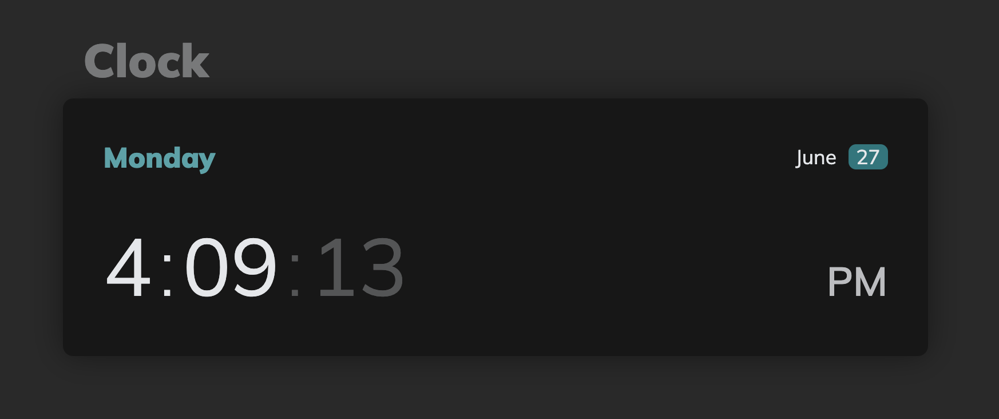
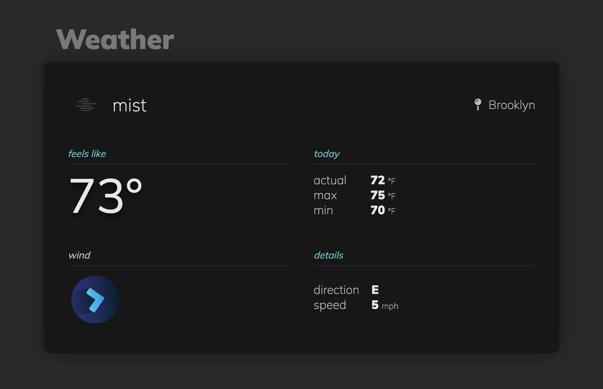
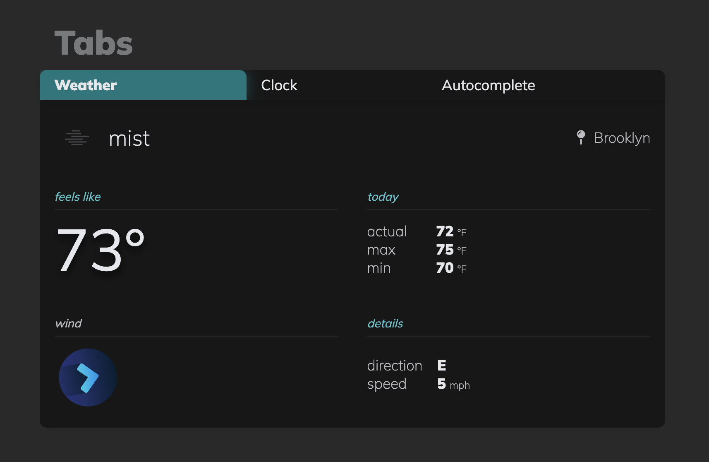

# React Widgets

**Table of Contents**
- [React Widgets](#react-widgets)
  - [Technologies Used](#technologies-used)
  - [Widgets](#widgets)
    - [**`Clock`**](#clock)
    - [**`Weather`**](#weather)
    - [**`AutoComplete`**](#autocomplete)
    - [**`Tabs`**](#tabs)


## Technologies Used
- `React.js` - Frontend JavaScript library
- `Webpack` - Module bundler
- `@babel/core` - JavaScript coverter for backwards compatibility
- `Geolocation API` - Request user's current location and 
- `Open Weather API` - Fetch free weather data for the user's location


## Widgets

### **`Clock`**
The `Clock` component displays the current date and time, updating every second.
- **Date**
  - Weekday (full length)
  - Month (full length)
  - Calendar date (two digit integer)
- **Time**
  - Seconds, minutes, and hours (in 12-hour format)
  - AM/PM indicator



<br>

### **`Weather`**
The `Weather` component provides local weather data in an organized and digestable fashion. Weather data includes:
- **Description**
  -  Short description of the current weather conditions along with a relevant icon
  - Current location being used for weather data
- **Temeratures** (all in fahrenheit)
  - `feelsLike` - what it currently 'feels like'
  - `actual` - what the actual current temperature is
  - `max` and `min` - highest and lowest temperatues for the current date
- **Wind**
  - Directional arrow icon that is rotated based on the current direction of wind
  - Two letter abbreviations for the compass direction of the current wind
  - Speed of current wind (imperial miles/hr)
  - Gusts (imperial miles/hr), only if there are high wind gusts in the forcast 



<br>

### **`AutoComplete`**
The `AutoComplete` component filters a list of names based on the user's input. Matches are detected by comparing the user's input to the list of names, each sliced to the length of input and checked for equality. When a user clicks on the recommended name, the field autocompletes the name and displays the company's data below the search bar.
- **Suggestions**
  - Absolute positioned list of company names recommened based on user's input
  - `onClick` event handler to complete the search and render the company data
- **Dynamic Lists**
  - The array of names suggested are provided as props, and therefore can easily be changed
  - Format of the company names accepted as props:
  ```javascript
    [{ name: "Apple", revenue: "$274.5 B" }, ...]
  ```


<br>

### **`Tabs`**
The `Tabs` widget is an interactive container that dynaically displays content based on the label selected by the user.
- **Dynamic Props**
  - Tabs are accepted as props in the following format:
  ```javascript
  [{title: "Weather", content: <Weather type='tab' />}, ...]
  ```
- **Active Tabs**
  - Selected tab index stored in component's state
  - Currently selected tab is styled with a blue background, box-shadow, and bold text



<br>